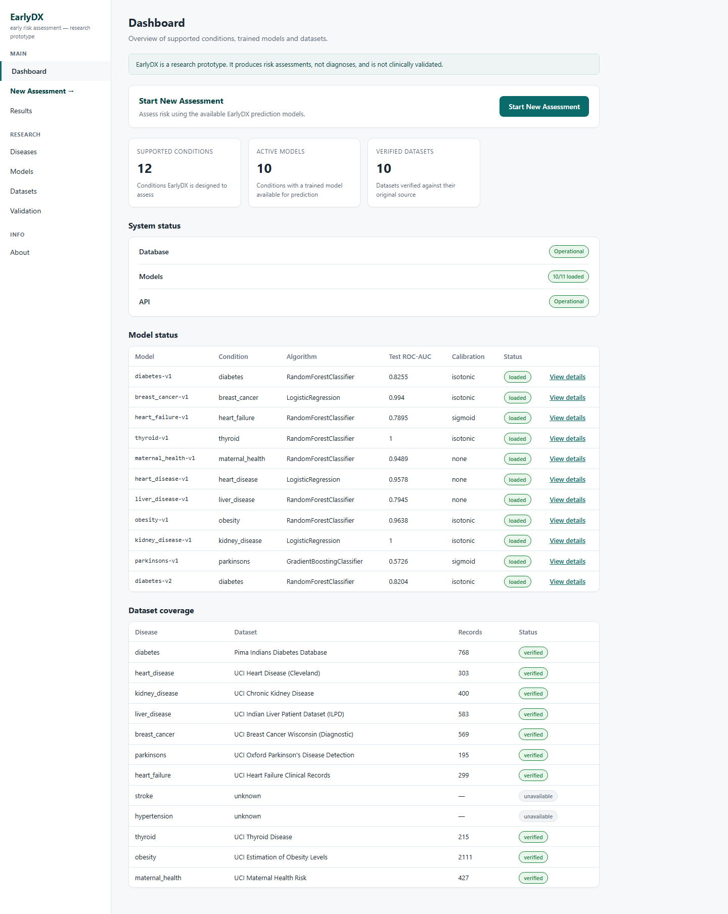
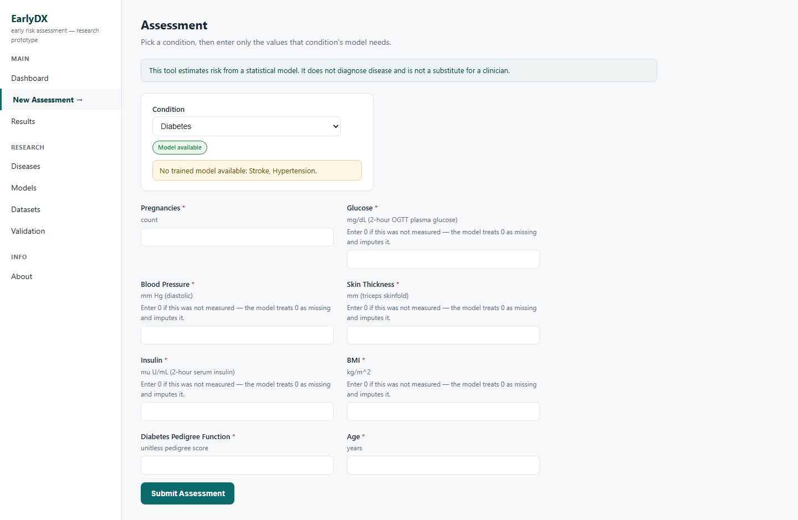
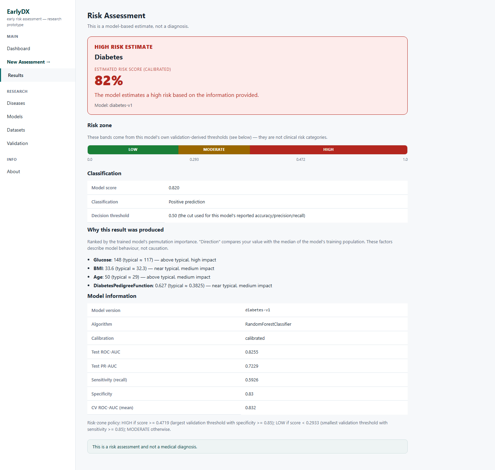
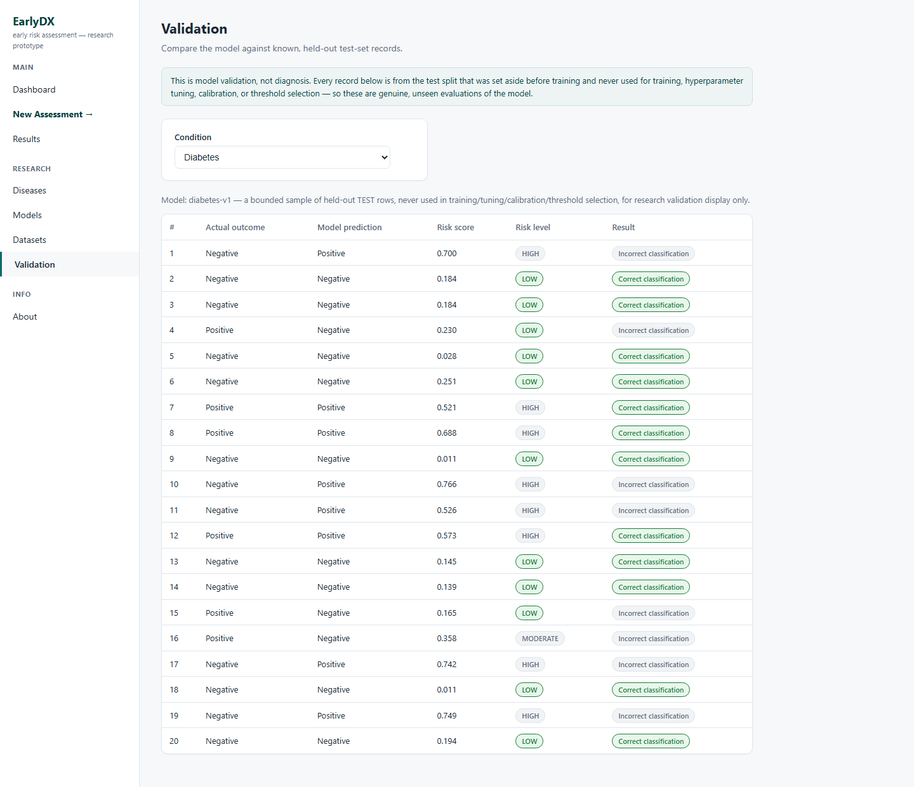
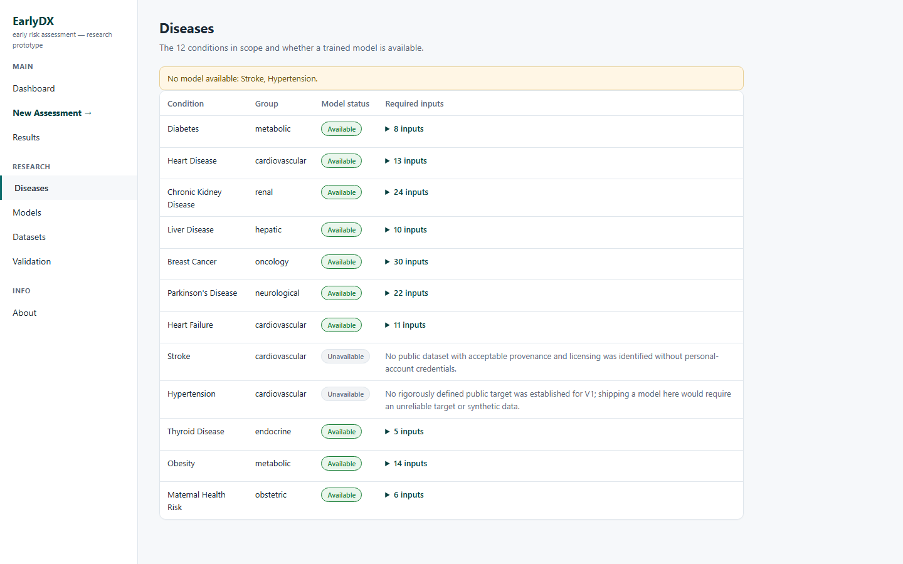
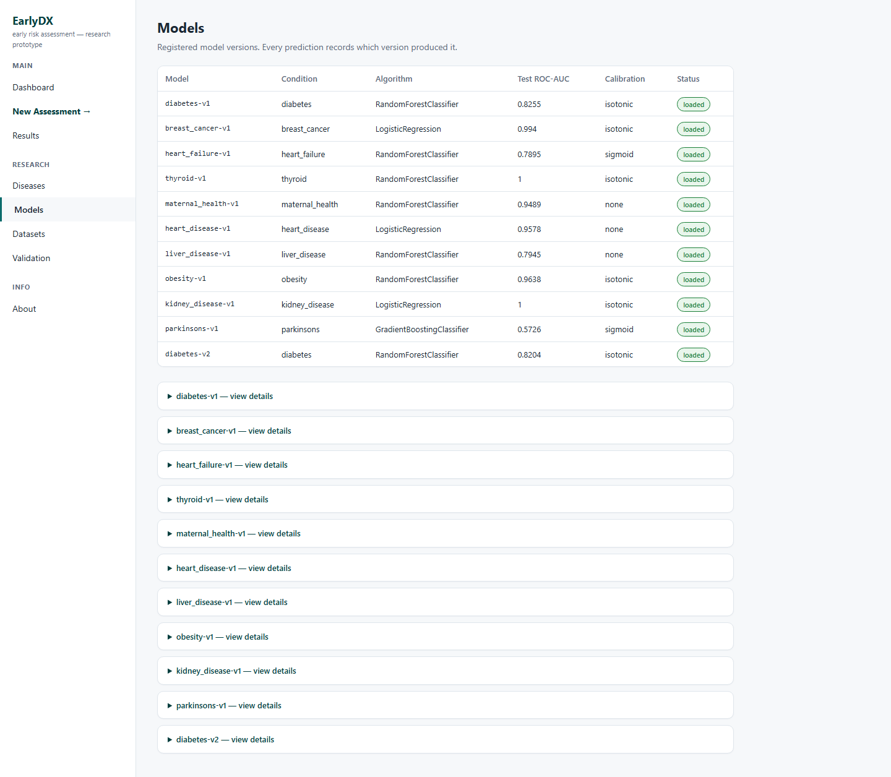
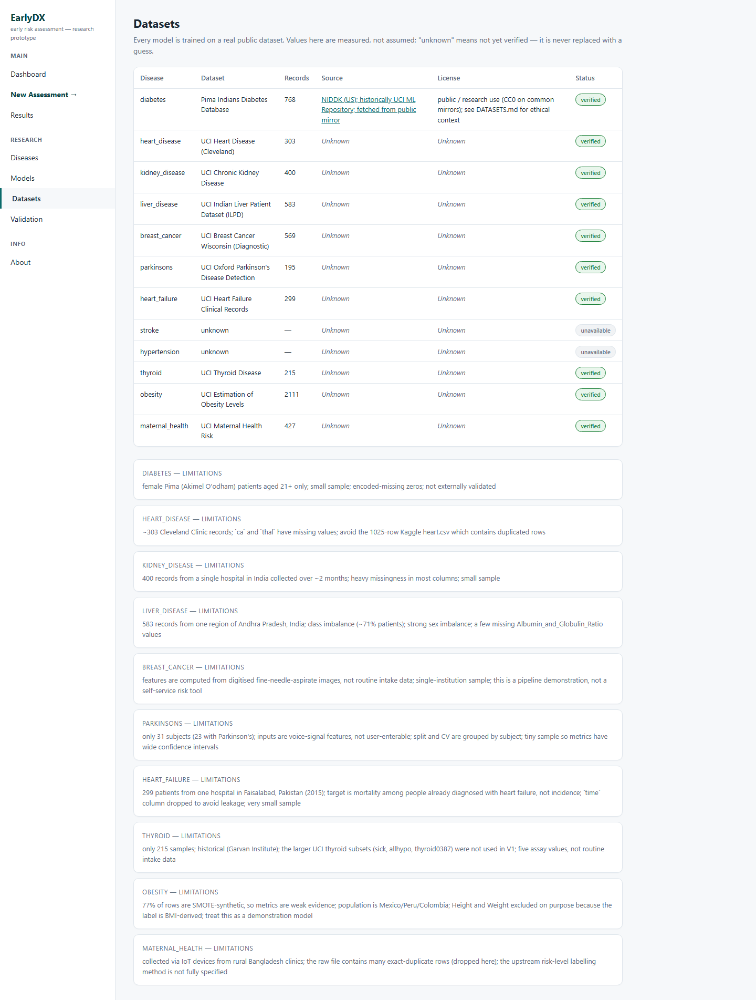

# EarlyDX

**Multi-disease early risk assessment — a research prototype, not a diagnostic system.**

EarlyDX trains one independent, leakage-safe machine-learning pipeline per disease on
real, publicly available, de-identified datasets, and serves per-disease **risk
estimates** through a FastAPI backend and a React + TypeScript frontend. Every number
the app shows — a metric, a threshold, an explanation — comes from an executed
training/evaluation run. Nothing is hand-written or invented.

> **Not a medical device. Not clinically validated. Not a diagnosis.**
> A risk score is a model output, not a statement about your health.
> See [`LIMITATIONS.md`](LIMITATIONS.md).

---

## Screenshots

| Dashboard | Assessment |
|---|---|
|  |  |

| Results | Validation |
|---|---|
|  |  |

<details>
<summary>More screenshots — Diseases, Models, Datasets</summary>

| Diseases | Models |
|---|---|
|  |  |



</details>

All screenshots above are from the app actually running end to end — the Results page
shows a real prediction for the diabetes model, and the Validation page shows the
model's real held-out test-set predictions against their known labels.

---

## What EarlyDX is

A portfolio / research project exploring what a transparent, multi-disease risk-screening
tool looks like when every claim is traceable to code: real datasets with documented
provenance and limitations, one scikit-learn pipeline per disease trained with
cross-validated hyperparameter search, validation-derived (not invented) decision
thresholds, and an explanation layer built on the model's own permutation importance.

**How it works:**

1. Pick a supported condition on the Assessment page.
2. Enter only the values that condition's model needs (with plain-language labels and
   units — the raw feature keys the model actually trained on are unchanged underneath).
3. EarlyDX sends those values to that disease's trained model.
4. The model returns a risk score and, where its own validation run defined them, a
   risk level.
5. The Results page shows the score together with the model's real performance metrics,
   its own explanation of which inputs it weighed most, and the research disclaimer.

---

## Status

| Condition | Group | Model |
|---|---|---|
| Diabetes | metabolic | ✅ trained (RandomForest, ROC-AUC 0.83) |
| Breast Cancer | oncology | ✅ trained (LogisticRegression, ROC-AUC 0.99) |
| Heart Disease | cardiovascular | ✅ trained (LogisticRegression, ROC-AUC 0.96) |
| Chronic Kidney Disease | renal | ✅ trained (LogisticRegression, ROC-AUC 1.00) |
| Liver Disease | hepatic | ✅ trained (RandomForest, ROC-AUC 0.79) |
| Heart Failure | cardiovascular | ✅ trained (RandomForest, ROC-AUC 0.79) |
| Thyroid Disease | endocrine | ✅ trained (RandomForest, ROC-AUC 1.00) |
| Obesity | metabolic | ✅ trained (RandomForest, ROC-AUC 0.96) |
| Maternal Health Risk | obstetric | ✅ trained (RandomForest, ROC-AUC 0.95) |
| Parkinson's Disease | neurological | ✅ trained (GradientBoosting, ROC-AUC 0.57 — weak; kept for transparency, see `MODEL_CARD.md`) |
| Stroke | cardiovascular | ⛔ no model — no public dataset with acceptable provenance/licensing found without personal-account credentials |
| Hypertension | cardiovascular | ⛔ no model — no rigorously defined public target for a real V1 label |

**10 of 12** in-scope conditions have a trained, actively-served model. The other 2 are
shown in the app as unavailable, with the real reason, rather than silently omitted.
Full per-model detail — algorithm selection, cross-validation, calibration comparison,
hyperparameter search, confusion matrix, permutation importance — is in
[`MODEL_CARD.md`](MODEL_CARD.md) and each model's `model_metadata.json`.

Diabetes test-set performance (stratified 60/20/20 split, `random_state=42`):

| metric | value |
|---|---|
| ROC-AUC | 0.8255 |
| PR-AUC | 0.7229 |
| Recall / sensitivity @ 0.5 | 0.5926 |
| Specificity @ 0.5 | 0.83 |
| Calibration | isotonic |

A tuned candidate (`diabetes-v2`, cross-validated hyperparameter search + an added
HistGradientBoosting candidate) was evaluated against this model and scored slightly
*worse* on the held-out test set — it was **not promoted**. That comparison is kept on
disk (`ml/diabetes/model_metadata.v2-experimental.json`) as a documented, honest result
rather than discarded.

---

## Architecture

```
data/          real datasets (git-ignored) + registry + inspection reports
ml/common/     reusable pipeline framework — preprocessing, CV, calibration,
               hyperparameter search, threshold selection, evaluation, model registry
ml/<disease>/  one pipeline per disease: load, spec, train
models/        trained joblib artifacts (committed — see "Model artifacts" below)
               + model_registry.json
backend/       FastAPI app — health, diseases, models, datasets, schema,
               predict, predict/all, validation
frontend/      React + TypeScript — dashboard, assessment, results, diseases,
               models, datasets, validation, about
```

```
 Browser  ──►  React/Vite frontend  ──►  FastAPI backend  ──►  trained sklearn
(Vercel)                                    (Render)            pipeline (.joblib)
                                                │
                                                ▼
                                     SQLite (dev) / Postgres (optional, prod)
                                     — best-effort assessment history only;
                                       predictions work with or without it
```

Full detail: [`ARCHITECTURE.md`](ARCHITECTURE.md).

### Per-disease pipeline

Every disease follows the identical, leakage-audited sequence in
`ml/common/framework.py`:

```
load → validate → stratified 60/20/20 split
     → hyperparameter search (GridSearchCV + StratifiedKFold, train split only)
     → candidate comparison on validation (LogisticRegression baseline vs.
       RandomForest / GradientBoosting / HistGradientBoosting)
     → cross-validation of the selected model
     → calibration choice (none / sigmoid / isotonic) by validation Brier score
     → decision thresholds derived from validation sensitivity/specificity targets
     → ONE held-out test evaluation
     → permutation importance + a bounded held-out validation sample
     → serialise artifact + feature schema + metadata + registry entry
```

The test split is touched exactly once, for final evaluation — never for tuning,
calibration, or threshold selection.

### Model artifacts

The `.joblib` files backing every **active** registry entry are committed directly to
this repo (`models/*.joblib`, ~53 MB total, no Git LFS needed — every file is well
under normal size limits). They are not regenerated at deploy time: production loads
them straight from the checked-out repo. Experimental/candidate artifacts that were not
promoted (e.g. `diabetes-v2`) are intentionally left out of git via `.gitignore`.

---

## Deployment

This repo is deployment-ready for the standard split:

```
Frontend  →  Vercel   (frontend/vercel.json — SPA rewrite for client-side routing)
Backend   →  Render   (render.yaml — Blueprint: build/start commands, health check)
```

Both are entirely environment-variable driven — no hardcoded `localhost` in
production code:

| Where | Variable | Purpose |
|---|---|---|
| Vercel (build-time) | `VITE_API_BASE` | Full backend URL, e.g. `https://earlydx-api.onrender.com` (no trailing slash, no `/api`) |
| Render | `EARLYDX_CORS_ORIGINS` | The deployed frontend's exact origin — never `*` in production |
| Render (optional) | `EARLYDX_DATABASE_URL` | Postgres URL; if unset, the API falls back to local SQLite and still serves predictions, it just won't persist assessment history |

See `render.yaml` and `.env.example` for the full variable list.

---

## Installation

Prerequisites: Python 3.11, Node 18+, (optional) Docker for local PostgreSQL.

```bash
# 1. Python environment
python -m venv .venv
.venv/Scripts/activate            # Windows;  source .venv/bin/activate on Unix
pip install -r requirements.txt -r backend/requirements.txt

# 2. Frontend
cd frontend && npm install && cd ..

# 3. Environment file
cp .env.example .env
```

---

## Run locally

```bash
# optional: PostgreSQL (otherwise the API falls back to a local SQLite file)
docker compose up -d

# backend  (http://localhost:8000, docs at /docs)
uvicorn backend.app.main:app --reload

# frontend (http://localhost:5173, proxies /api -> :8000)
cd frontend && npm run dev
```

---

## Reproduce a model

```bash
python scripts/download_diabetes.py         # fetch the real dataset into data/raw/
python scripts/inspect_dataset.py diabetes   # measured inspection report
python scripts/train_disease.py diabetes     # train, evaluate, calibrate, serialise
```

Any of the 10 trained diseases can be substituted for `diabetes`. This writes the
`models/<disease>-v1.joblib` artifact, `ml/<disease>/feature_schema.json`,
`ml/<disease>/model_metadata.json`, updates `models/model_registry.json`, and
regenerates that disease's section of `MODEL_CARD.md`.

---

## API

| Method | Path | Purpose |
|---|---|---|
| GET | `/health` | liveness, loaded-model count, DB status |
| GET | `/diseases` | the 12 conditions + model availability |
| GET | `/models` | model registry |
| GET | `/datasets` | dataset registry, including documented limitations |
| GET | `/schema/{disease}` | required feature schema for a form |
| POST | `/predict/{disease}` | risk score + risk level + contributing factors |
| POST | `/predict/all` | runs only the models whose full feature schema is satisfied; others returned in `skipped` |
| GET | `/validation/{disease}` | a bounded sample of held-out test-set rows with real labels vs. the model's own predictions |

`/predict/*` never fills a missing medical value with a default.

---

## Testing

```bash
pytest                       # ML + backend (36 tests)
cd frontend && npm test      # frontend flow (vitest)
```

---

## Documentation

- [`ARCHITECTURE.md`](ARCHITECTURE.md) — system design and the per-disease pipeline contract
- [`DATASETS.md`](DATASETS.md) — every candidate dataset, source, licence, limitations
- [`MODEL_CARD.md`](MODEL_CARD.md) — every trained model, generated from evaluation runs
- [`LIMITATIONS.md`](LIMITATIONS.md) — dataset bias, class imbalance, false negatives, non-clinical status
